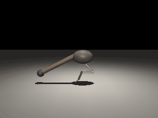

# Squirrel Robot 
Squirrel-inspired robot

One squirrel hindlimb plus a tail, in the sagittal plane: model, whole-body
trajectory optimisation for a jump, and the checks that decide whether a solved
trajectory is real.



Crouch, push, fly, land - 80 mm of COM rise, landing foot placed 150 mm ahead of
the take-off foot. This is the plan, played back kinematically. In MuJoCo physics,
feedforward torque plus joint PD tracks the push to within 3 deg of body pitch, but
leaves 9 deg at liftoff and the body tumbles in flight: nothing feeds back body
attitude yet (`python -m studies.track`).

```
models/squirrel_leg.xml   the model.  Hand-written, with marker slots the tail is
                          spliced into - edit this, never a generated file
core/                     the library
  model.py                build the MJCF, pose it, stand it on the floor, film it
  model_pin.py            the same robot in Pinocchio, plus collision sample points
  to_jump.py              the optimal control problem
  verify_to.py            solve it, and generate collision constraints from MuJoCo
  view.py                 live window or GIF
studies/                  one-off experiments, each with its own selfcheck
out/                      everything generated (gitignored)
```

## Running

```bash
python -m core.verify_to            # solve the jump and verify it
python -m core.view gif out/to_jump.npz
python -m studies.stance          # plantigrade stands, digitigrade topples
python -m studies.tail_authority  # what one tail hinge buys in flight
python -m studies.tail_tuning     # does a redundant tail buy anything?  (no)
python -m studies.reach           # landing accuracy and how far it can go
```

macOS live viewer needs `mjpython`, which needs `otool`:

```bash
PATH="/Library/Developer/CommandLineTools/usr/bin:$PATH" mjpython -m core.view live plantigrade
```

## The robot

Every physical spec — masses, inertias, joint ranges, tail, contact, actuators — and
how it compares with a real grey squirrel: **[model.md](model.md)**.

## The problem

The full optimal control problem — model, discretisation, objective, every
constraint, how it is solved, current numbers and a changelog of what changed
mathematically — lives in **[formulation.md](formulation.md)**, kept in step with
the code.

## Three layers of checking

A converged solve proves nothing.  Every trajectory passes through:

1. **IPOPT converged** - says only that the equations were satisfied.
2. **`core.to_jump.audit`** - in flight the COM must be a parabola with exactly
   -9.81, the rise must be the one that was asked for, nothing dips through the
   floor.  This caught a jump that was perfectly physical and 2.2x too high,
   because the liftoff constraint sat one knot too early.
3. **MuJoCo narrowphase** - the collision constraints in the OCP are point
   samples, an approximation.  MuJoCo's own detector is the referee, and it
   caught the tail sweeping 20 mm through the metatarsus while the sampled
   constraints reported everything fine.

Collision constraints are generated lazily from (3): solve, ask MuJoCo what
overlapped, constrain those pairs, solve again.  Two rounds is typical.
Constraining every pair up front is 64 rows a knot and segfaults IPOPT.

## What the model is not

Squirrels bound on four limbs.  This is one hindlimb in a plane, so it can speak
to hindlimb torque budget, ankle loading and tail attitude authority - and cannot
speak to fore/hind coordination, spine flexion, or roll.  The landing constraint
in particular asks a single hindlimb to absorb a landing the animal takes on its
forelimbs.
